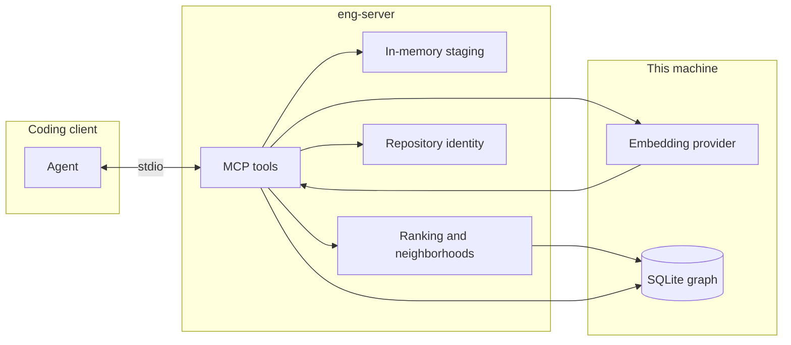
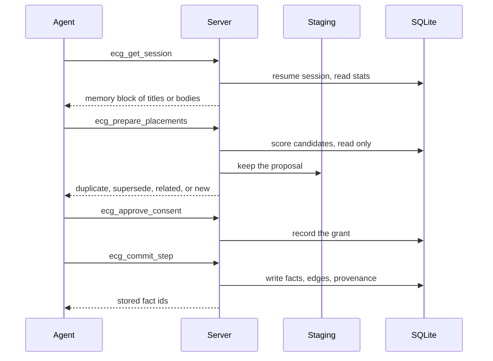
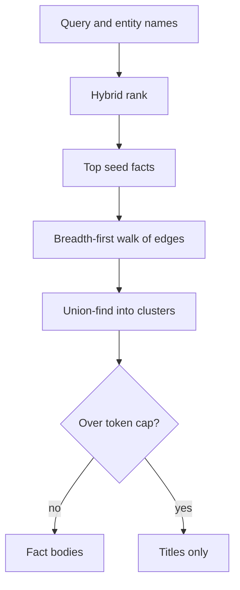

# Engineering Continuity Graph

Local memory for AI coding sessions. A new chat forgets the decisions, constraints, and failures from the last one. Replaying the whole transcript is expensive and mostly noise. This project stores those facts as a small graph on your machine and returns only the connected neighborhood a new session needs.

The server stores, ranks, and enforces consent. It does not decide what a fact is. The coding agent does. Two rules hold for every run:

- Nothing is stored without your consent.
- Fact bodies enter a transcript only through an approved recall.

Design detail lives in the [high-level design](docs/HLD.md) and the [low-level design](docs/LLD.md).

## Architecture

The process is one local MCP server over stdio. SQLite is the only durable store. Proposals that you have not approved live in process memory and disappear on restart.



A session has two paths.



Recall never trusts a fact-id list from the caller. The server ranks the query, walks the edges, and returns whole facts grouped into clusters.



## What gets stored

Each fact is a title, a body, a type, a confidence, and the entities it mentions. Facts link to each other with weighted edges. A later fact can supersede an older one. The older fact stays in the graph so history remains readable.

| Piece | Role |
| --- | --- |
| Fact | The durable unit: title, body, type, status, confidence |
| Entity | A deduplicated name such as a file, symbol, or concept |
| Edge | A typed, weighted link between two facts |
| Conflict | An unresolved contradiction or low-confidence supersede |
| Exchange | The approved turns that explain why a fact was stored |

Suggested fact types are `file`, `symbol`, `concept`, `decision`, `architecture`, `failure`, `requirement`, `discovery`, and `env_constraint`. Other types are accepted.

## Consent

Storage is default-deny.

| Decision | Effect |
| --- | --- |
| `approve_run` | One successful commit. A failed commit keeps the grant so a retry can use it. |
| `approve_session` | Storage stays on for the rest of this session. |
| `reject` | Recorded for audit. Does not authorize storage. |
| `reject_session` | Storage stays off and further consent prompts stop. |

`ecg_commit_step` and `ecg_approve_consent` are the checkpoints. Their arguments are what you read in the client approval dialog.

## Quick start

Python 3.11 or newer.

```bash
python -m venv .venv
source .venv/bin/activate
pip install -e ".[dev]"
pytest
```

Run the server on stdio:

```bash
eng-server
```

Point an MCP client at that command with `PYTHONPATH` set to `src`, or install the package and call `eng-server` directly. `scripts/setup.py` can merge an entry into a local Claude desktop config. `--print` shows the entry and does not write. `--force` replaces an existing entry.

Optional neural embeddings, still offline:

```bash
pip install -e ".[embeddings]"
```

The default provider is `testing`: deterministic 4-gram vectors, no model download. `sentence-transformers` and `openai-transformers` refuse to run unless the model is already cached.

## Tools

Every tool name is prefixed with `ecg_` so it does not collide with another MCP server in the same client.

| Tool | Writes SQLite | What it does |
| --- | --- | --- |
| `ecg_get_session` | Session row only | Start or resume a session and return a memory block |
| `ecg_prepare_placements` | No | Score candidate facts and stage a proposal |
| `ecg_commit_placements` | No | Record merge, replace, or drop choices on that proposal |
| `ecg_record_provenance` | No | Stage the turns that explain the proposal |
| `ecg_approve_consent` | Grant row | Record your consent decision |
| `ecg_commit_step` | Yes, under consent | Store facts, edges, and provenance for one exchange |
| `ecg_cancel_step` | No | Drop a staged proposal |
| `ecg_discard_proposal` | No | Drop everything staged after you decline |
| `ecg_search_context` | No | Return the smallest fact neighborhood for a query |
| `ecg_list_conflicts` | No | List open conflicts, titles and ids only |
| `ecg_resolve_conflict` | Yes | Keep the new fact, the old fact, or both |
| `ecg_stats` | No | Counts for the repository |

## Local commands

These talk to the SQLite file directly. Every path exits 0, including bad arguments, so a prompt hook cannot block you.

```bash
python -m eng_graph --repo . status
python -m eng_graph --repo . resolve_conflict
python -m eng_graph --repo . clear
python -m eng_graph --repo . clear --yes
```

`clear` is a dry run until you pass `--yes`.

## Configuration

| Variable | Default | Meaning |
| --- | --- | --- |
| `ECG_DB_PATH` | `.convo/memory.db` | SQLite file. `.eng_graph/` is used when that directory already exists and `.convo/` does not. |
| `ECG_EMBEDDING_PROVIDER` | `testing` | `testing`, `sentence-transformers`, or `openai-transformers` |
| `ECG_AUTO_INJECT` | `chat` | `chat` returns fact bodies. `preview` returns titles. |
| `ECG_AUTO_INJECT_MAX_TOKENS` | `2500` | Above this, a recall degrades to titles and says why. |
| `ECG_DEBUG` | `0` | Write server diagnostics to stderr. |

## Repository layout

```text
src/eng_graph/
  __main__.py     MCP tools
  state.py        Sessions, consent, facts, edges, conflicts
  core.py         Placement, ranking, neighborhood, rendering
  db.py           SQLite connection and schema
  repo.py         Repository identity from files on disk
  staging.py      In-memory proposals
  models.py       Constants and request models
  cli.py          Local status, preview, and clear
  embeddings/     Offline embedding providers
docs/
  HLD.md          High-level design
  LLD.md          Low-level design
```

## License and citation

Apache License 2.0. Copyright 2026 Mohd Aman. See [LICENSE](LICENSE) and [NOTICE](NOTICE).

If you use this software, cite it with the metadata in [CITATION.cff](CITATION.cff).
