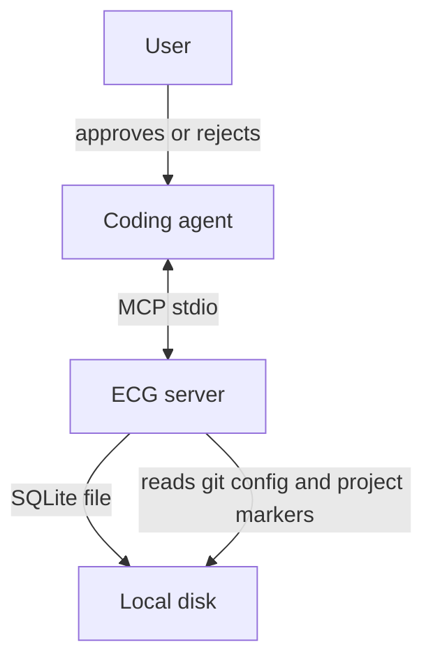
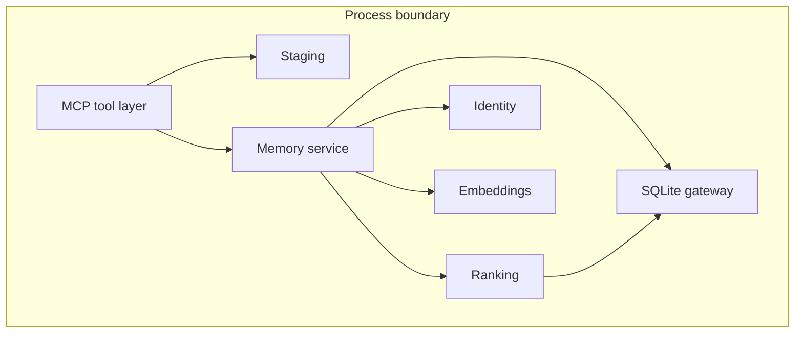
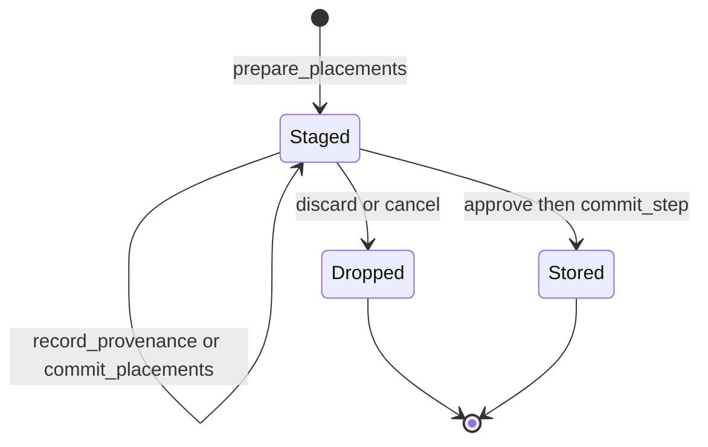
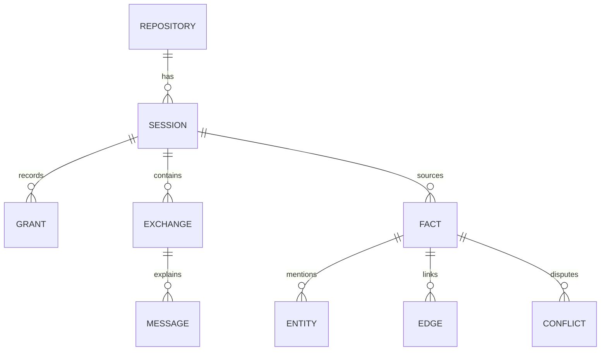

# High-level design

Engineering Continuity Graph (ECG) is a local memory service for coding agents. It keeps a graph of engineering facts for one repository and returns the smallest connected set of those facts that a new session needs.

This document describes the system from the outside: who uses it, what the major parts are, and the rules that must not change. Module-level behavior is in [LLD.md](LLD.md). The picture for a first read is in the [README](../README.md).

## Problem

A coding agent starts each chat with an empty context. The useful residue of earlier chats is a handful of decisions, constraints, failures, and architecture choices. The transcript itself is an execution trace. Shipping that trace back into the next prompt costs tokens and buries the fact that matters.

ECG separates memory from the transcript.

- The agent proposes facts.
- The user consents before those facts become durable.
- A later session receives a ranked neighborhood, not the history.

## Goals

- Durable facts survive process restarts. Abandoned proposals do not.
- Recall returns whole facts in a connected neighborhood, with a hard cap on how much text is injected.
- Consent is an API gate. A missing grant refuses the write.
- Repository identity does not spawn a child process. An MCP server shares stdio with its client, and a child process can stall that pipe.
- The database and the embedding provider fail independently. A broken vector model still lets the session open.

## Non-goals

- No hosted service, no accounts, no sync across machines.
- No vector index. Similarity is a linear scan, which is enough at the size of one repository's decisions.
- No redaction pipeline and no multi-user merge.
- The server does not invent facts and does not summarize a chat on its own.

## Context



The user never talks to the server directly. The agent calls tools. Two of those tools are the approval checkpoints: `ecg_approve_consent` and `ecg_commit_step`. Their arguments are shown in the client's native approval dialog, so the agent must pass the real grant, titles, and bodies.

## Components



| Component | Responsibility |
| --- | --- |
| MCP tool layer | Names, docstrings, and error wrapping. One tool call returns one JSON object or one memory block. It does not hold the SQLite lock across embedding work. |
| Staging | Proposals and provenance that have not been committed. Process memory only, 30-minute TTL. |
| Memory service | Sessions, consent, commits, recall, conflicts, and stats. |
| Ranking | Duplicate and supersede classification, seed ranking, neighborhood expansion, cluster labels, token estimate. |
| Identity | Stable repository id from `.git/config`, a git root, or a project marker. No subprocess. |
| Embeddings | A vector for each fact and each query. Computed before the write lock is taken. |
| SQLite gateway | One connection, a short lock timeout, read-only until the first real write, WAL mode after that. |

## Main flows

### Open a session

`ecg_get_session(path)` resolves the repository, opens or creates the database, and resumes the latest session for that repository. It reports database health and embedding health as separate objects. When facts already exist, it builds an automatic memory block for the repository name plus a broad query about architecture, decisions, constraints, and failures.

That block is either full bodies or titles. Titles are used when `ECG_AUTO_INJECT=preview` or when the rendered block would exceed `ECG_AUTO_INJECT_MAX_TOKENS`.

### Propose and store



1. The agent sends candidate facts to `ecg_prepare_placements`.
2. The server scores each candidate against existing facts and stages a proposal. Nothing is written yet.
3. The agent may attach provenance and adjust actions (`merge`, `replace`, `drop`, `supersede`).
4. The user grants `approve_run` or `approve_session`.
5. `ecg_commit_step` writes the exchange, messages, facts, embeddings, entities, and edges in one transaction.

A proposal that is abandoned, declined, or still sitting at process exit leaves no database row. That is the privacy property of staging.

### Recall

`ecg_search_context` is the only path that copies fact bodies into the transcript.

1. Embed the query.
2. Blend cosine similarity, lexical BM25, and entity overlap.
3. Keep the best seeds above a score floor.
4. Walk edges breadth-first, up to two hops, skipping weak edges.
5. Split the walked set into connected clusters.
6. Render bodies, or titles if the block is over the token cap.

The server records the fact ids it chose. A caller cannot pass a longer list and widen the result.

### Conflicts

A high-confidence, unambiguous supersede marks the old fact `superseded` and links `supersedes`. A low-confidence or ambiguous supersede keeps both facts, marks the new one disputed, links `contradicts`, and opens a conflict.

The user resolves a conflict as `new`, `old`, `existing`, or `both`. The loser is marked superseded and linked. Rows are not deleted.

## Consent model

```mermaid
stateDiagram-v2
  [*] --> Default
  Default --> SessionAll: approve_session
  Default --> Rejected: reject_session
  Default --> Default: approve_run consumed by one commit
  Default --> Default: reject is audit only
  SessionAll --> SessionAll: further commits allowed
  Rejected --> Rejected: writes refused, prompts off
```

| Mode | May store | Ask again |
| --- | --- | --- |
| `default` | Only with an unconsumed `approve_run` | Yes |
| `session_all` | Yes | Yes |
| `session_rejected` | No | No |

`reject` does not change the mode. It is an audit row and never authorizes a write.

## Data kept on disk

One SQLite file per repository, default `.convo/memory.db`.



Facts, entities, and edges are the graph. Exchanges and messages are provenance. Grants are the consent log. Conflicts are the queue of disagreements the user has not settled.

## Trust boundary

Everything runs on the user's machine. The threat the design actually addresses is accidental memory: a proposal stored before the user agreed, or a recall that dumps the whole history into context.

- Writes check the grant inside the same transaction that inserts facts.
- A failed commit rolls back and leaves an `approve_run` grant unconsumed.
- Recall builds its fact set on the server.
- Staging is not serialized. A crash is a discard.
- Identity resolution reads files. It does not execute git.

## Deployment

ECG is a console script, `eng-server`, speaking MCP over stdio. There is no port. The client starts the process and stops it. The SQLite file is the deployment unit: copy the repository directory and the memory file comes with it, unless `ECG_DB_PATH` points elsewhere.

The local `eng` command reads that same file for status, a memory preview, and a dry-run clear. It is safe to wire into a prompt hook because every path exits 0.

## Operational limits

| Limit | Value | Why |
| --- | --- | --- |
| Lock wait | 2 seconds | A stuck writer must not hang the client |
| Staging TTL | 30 minutes | Abandoned proposals expire |
| Neighborhood depth | 2 | Recall stays local to the seed facts |
| Auto-inject cap | 2500 tokens | One broad match cannot fill the window |
| Facts per commit | 30 | One dialog stays reviewable |
| Title / body | 500 / 20000 characters | Bound a single placement |
