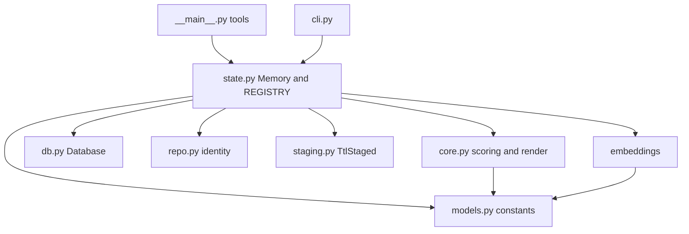
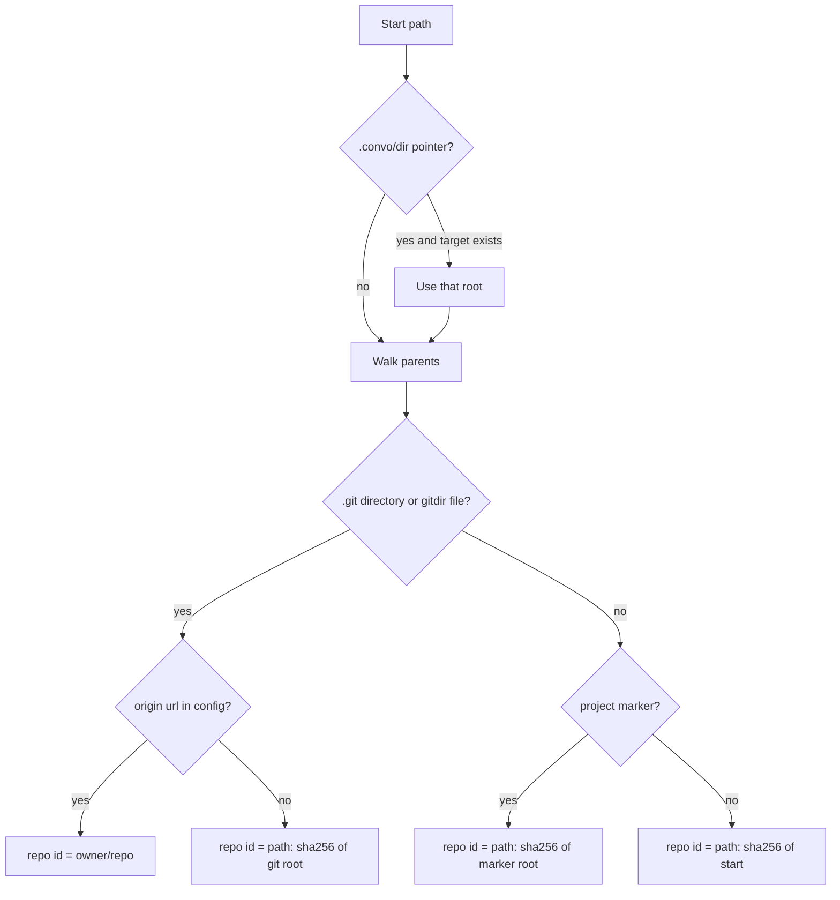
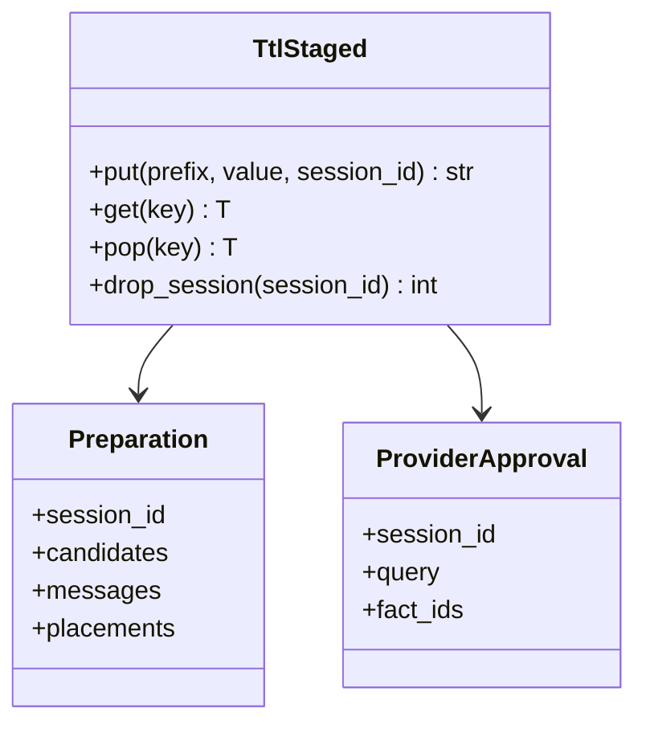
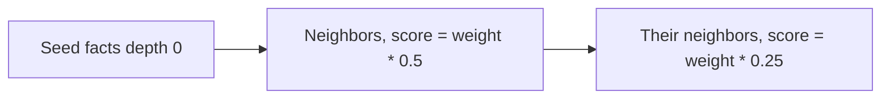
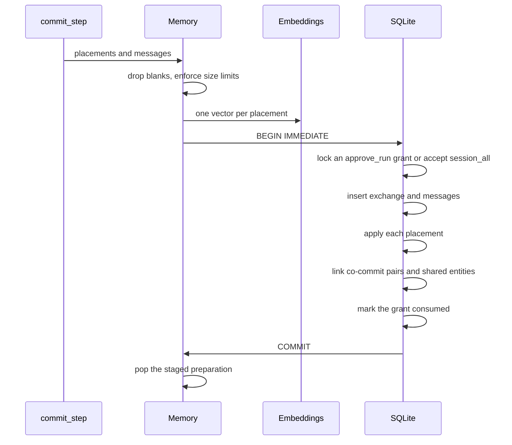

# Low-level design

This document specifies the modules, schema, scoring, and write path implemented in `src/eng_graph`. The system view is in [HLD.md](HLD.md).

## Module map



| Module | Public surface |
| --- | --- |
| `__main__.py` | FastMCP server. Each tool is wrapped so a missing session or a database error becomes `{ok: false, error, message}` instead of a crashed stdio pipe. `ecg_search_context` returns a string. |
| `state.py` | `get_session`, `prepare_placements`, `commit_placements`, `record_provenance`, `approve_consent`, `commit_step`, `cancel_step`, `discard_proposal`, `search_context`, `list_conflicts`, `resolve_conflict`, `stats`. Also the CLI helpers `preview_repository`, `status_for_root`, `clear_root`. |
| `core.py` | Placement classification, hybrid rank, breadth-first expansion, union-find clusters, markdown render. |
| `db.py` | `Database.read` and `Database.write`. Schema version 1. |
| `repo.py` | `resolve_repository`, `normalize_remote`. |
| `staging.py` | `TtlStaged`, `Preparation`, `ProviderApproval`. |
| `embeddings/` | `get_provider`, cosine similarity, `TestingProvider`, offline neural providers. |
| `cli.py` | `status`, `clear`, and the default preview command. Always `sys.exit(0)`. |

A process-wide `REGISTRY` holds open databases, the staging maps, and the embedding provider. Tests call `reset_registry()` so cases do not share a connection.

## Repository identity

`resolve_repository(path)` never calls `subprocess`, `os.system`, or `Popen`.



Remote parsing accepts `git@host:Owner/Repo.git`, `https://host/Owner/Repo.git`, `ssh://`, and `file://` or absolute local paths. Hosted remotes become a lowercased `owner/repo` with a trailing `.git` removed. Local remotes become a path relative to the home directory when they live under it.

A `.git` file that contains `gitdir:` is followed, including a relative gitdir and a `commondir` file, so worktrees and submodules still yield the shared config.

Markers, in order, are `.git`, `.clerk`, `pyproject.toml`, `package.json`, `Cargo.toml`, `go.mod`, `setup.py`, `composer.json`, and `Gemfile`.

The id is stored on `repositories.id` and reused for every session of that checkout.

## Schema

`Database` does not open a file at import or during server construction. `read()` opens `mode=ro` and raises `DatabaseMissing` when the file is absent. The first `write()` reopens `mode=rw`, or `mode=rwc` when the file must be created, then applies the migration.

Connection settings:

- `uri=True`, `check_same_thread=False`, `isolation_level=None`
- `PRAGMA foreign_keys=ON`
- `PRAGMA busy_timeout=2000` and a 2-second `sqlite3` timeout
- On a writable connection: `PRAGMA journal_mode=WAL` and `PRAGMA synchronous=NORMAL`
- One `RLock` around the connection. `acquire` waits at most 2 seconds, then raises `DatabaseBusy`.

`write()` runs `BEGIN IMMEDIATE` and `ROLLBACK` if the body raises. The lock is released in `finally`. Embedding calls happen before `write()` so the lock is never held across model work.

| Table | Key columns |
| --- | --- |
| `schema_meta` | `version` |
| `repositories` | `id`, `path`, `remote_url`, `created_at` |
| `sessions` | `id`, `repo_id`, `mode`, `ask_prompt`, `may_store`, timestamps |
| `consent_grants` | `id`, `session_id`, `decision`, `consumed`, `created_at`, `consumed_at` |
| `exchanges` | `id`, `session_id`, `created_at` |
| `messages` | `exchange_id`, `role`, `content`, `ordinal` |
| `facts` | `id`, `repo_id`, `session_id`, `exchange_id`, `title`, `body`, `fact_type`, `status`, `confidence`, `disputed`, `promoted`, `superseded_by`, timestamps |
| `fact_embeddings` | `fact_id`, `dim`, packed float32 `vector`, `provider` |
| `entities` | unique `(repo_id, normalized_name, entity_type)` |
| `fact_entities` | `(fact_id, entity_id)` |
| `edges` | `src_fact_id`, `dst_fact_id`, `edge_type`, `weight`; unique on that triple |
| `conflicts` | `new_fact_id`, `existing_fact_id`, `conflict_type`, `status`, `resolution` |
| `facts_fts` | FTS5, `porter` tokenizer, columns `title`, `body`, unindexed `fact_id` |

Indexes cover facts by repository and status, sessions by repository, both edge endpoints, grants by session, and entities by repository.

A schema version newer than `SCHEMA_VERSION` (1) raises `DatabaseCorrupt`. Older versions are migrated in place by the `CREATE IF NOT EXISTS` statements.

## Identifiers

| Prefix | Example use |
| --- | --- |
| `sess_` | Session |
| `grant_` | Consent grant |
| `prep_` | Staged preparation |
| `prov_` | Recall approval record |
| `fact_` | Fact |
| `edge_` | Edge |
| `conf_` | Conflict |
| `ent_` | Entity, SHA-256 of `repo_id\|normalized name\|type`, 16 hex chars |

Ids use `uuid4` truncated to 16 hex characters, except entities, which are content-addressed so the same name and type in one repository collapse to one row.

## Request models

`CandidateIn` and `PlacementIn` accept extra JSON fields and ignore them. Required content is `title`. Defaults: empty body, fact type `concept`, confidence `1.0`, action `new`.

Entities are `{name, entity_type}`. Unknown fact types, entity types, and placement actions are stored. Unknown consent strings are stored and do not authorize a write.

Validation inside the commit, before the lock:

- At most 30 actionable placements. `drop` and a blank title do not count.
- Title at most 500 characters. Body at most 20,000.
- Confidence is clamped to `[0, 1]`. Non-numeric and NaN become `0`.

## Staging



`TtlStaged` keeps `(expiry, value, session_id)` behind an `RLock`. Default TTL is 1800 seconds. Keys look like `prep_<16 hex>` and `prov_<16 hex>`. `get` and `put` purge expired rows. There is no disk write. `discard_proposal` drops every staged object for that session.

`Preparation` holds the candidates, the agent's placement decisions, and provenance messages. `ProviderApproval` holds the fact ids a recall just selected. Search reloads bodies from those ids so a caller-supplied id list cannot widen the export. The search tool signature has no fact-id parameter.

## Embeddings

`ECG_EMBEDDING_PROVIDER` selects the provider. The default is `testing`.

| Name | Behavior |
| --- | --- |
| `testing` | Hashed 4-grams into 256 dimensions, L2-normalized. Same text, same vector. |
| `sentence-transformers` | `all-MiniLM-L6-v2` with `HF_HUB_OFFLINE=1` and `local_files_only`. A cache miss raises `ModelUnavailable`. |
| `openai-transformers` | Offline `transformers` mean pool of the last hidden state. Same cache-miss behavior. Model override: `ECG_OFFLINE_MODEL`. |

Cosine similarity is the dot product of normalized vectors, clamped to `[0, 1]`. Distance is `1 - similarity`.

`embedding_status()` runs once per process, stores the result on `REGISTRY`, and returns `{ok, provider, dimensions}` or `{ok: false, provider, error}`. `get_session` always includes this object, including when the database cannot be opened.

## Placement scoring

For a candidate fact, compare it with every non-rejected fact in the repository.

```text
score = 0.50 * cosine + 0.20 * lexical + 0.30 * entity_overlap
```

- Cosine uses the candidate vector and the stored fact vector. Missing vectors contribute `0`.
- Lexical is SQLite FTS5 BM25 on title and body. BM25 is more negative when the match is better. Scores are min-max normalized onto `[0, 1]` across the hits for this query. The query is up to 24 tokens joined by `OR`, with stopwords and FTS operators removed.
- Entity overlap is the Jaccard index of normalized names. Names come from the candidate's entity list plus shapes inferred from the text: backtick spans, paths, dotted names, snake_case, and CamelCase. At most 16 entities are attached to a new fact.
- When either side has no entities, the entity term is dropped and the remaining weights are rescaled to the same 50:20 ratio, so a text-only duplicate can still score `1.0`.

A fact already marked `superseded` loses `0.20` before classification.

| Classification | Rule |
| --- | --- |
| `possible_supersede` | Action is `supersede` or `replace`, and the adjusted score is at least `0.75` |
| `likely_duplicate` | Adjusted score is at least `0.85` and the fact types match |
| `related` | Adjusted score is at least `0.45` |
| `new` | Otherwise |

Recommended actions: `likely_duplicate` → `merge`, `possible_supersede` → `replace`, `related` → `new`, `new` → `create`. An explicit action other than blank or `new` is kept.

Status heuristic for a newly written fact, from confidence:

| Confidence | Status | `promoted` |
| --- | --- | --- |
| `< 0.50` | `draft` | 0 |
| `< 0.75` | `proposed` | 0 |
| otherwise | `approved` | 1 |
| action `drop` | `rejected` | not written as a fact |

## Recall ranking

Same blend as placement, then:

- `superseded` facts lose `0.20`
- `draft`, `proposed`, or any fact with `promoted = 0` lose `0.25`
- `disputed` facts lose `0.50`
- A Jaro-Winkler typo bonus against the title adds up to `0.08` (`0.08` at similarity `>= 0.92`, `0.04` at `>= 0.84`, or `0.05` when Levenshtein distance is within a short limit)
- The score is clamped to at most `1`
- Anything below `0.20` is dropped

Seeds are the top `limit` remaining facts. `limit` is clamped to `1..20` and defaults to `8`.

## Neighborhood and clusters

Edges are stored directed and queried as undirected. Expansion builds an adjacency list of edges whose weight is at least `0.30`.



Maximum depth is 2. A node already reached by a shorter path is not re-queued. Rejected facts are skipped. Each reached fact is included whole: title, body, type, status, confidence, dispute flag, source session, and entity names.

Default edge weights when the server inserts a link:

| Edge | Weight |
| --- | --- |
| `depends_on` | 1.00 |
| `attempted_for` | 0.90 |
| `caused_by` | 0.80 |
| `contradicts` | 0.75 |
| `verifies` | 0.75 |
| `mentions` | 0.50 |
| `supersedes` | 0.50 |
| `relates_to` | 0.25 |

Two links are added by the commit itself:

- Every pair of facts created in the same exchange gets `relates_to` at `0.80`.
- A new fact and any other fact that shares an entity get `mentions` at `0.50`, up to 32 neighbors.

`relates_to` at its catalog weight of `0.25` would sit under the `0.30` walk threshold. The co-commit edge uses `0.80` so facts stored together remain one cluster. The shared-entity edge uses `0.50` so it is walked.

Union-find runs on the facts that expansion kept, unioning only endpoints that are both in that set. A cluster's label is the entity name shared by the most facts. Ties break alphabetically. With no entities, the label is the highest-scoring fact's title.

## Rendering

`estimate_tokens` is `(len(text) + 3) // 4`.

`render_memory` emits one fenced block:

- `<engineering-memory>` with bodies when the mode is `chat` and the estimate is within the cap
- `<color/preview>` with titles, ids, and a one-line reason otherwise

Each full fact lists id, status, disputed flag, confidence, source session, entities, and the body. The preview lists `type: title (id) disputed`.

`ecg_get_session` uses this render for the automatic block. If the ranked query is empty, the CLI preview falls back to the eight newest active facts.

## Commit path



If the exchange id was already committed for this session, the call returns `already_committed: true` and the previous fact rows. It does not consume another grant.

Grant lock, inside the transaction:

- `session_rejected` raises `ConsentDenied`
- `session_all` needs no grant row
- otherwise the oldest unconsumed `approve_run` row is selected
- no such row raises `ConsentDenied` and the transaction rolls back
- after the inserts succeed, that row is updated to `consumed = 1`
- if the update does not change exactly one row, the transaction rolls back and the grant stays available

### Placement actions

| Action | Effect |
| --- | --- |
| `drop` | Skipped |
| `new` | Treated as `create` |
| `create` | Insert fact, embedding, FTS row, entities |
| `merge` | Append the new body to the target body when it is not already present, refresh FTS and the embedding |
| `update` | Replace the target body |
| `replace`, `supersede` | Insert the new fact, then supersede or open a conflict |

`merge` and `update` need a target id, or the best scored match. A missing target falls through to `create`.

### Supersede rule

`should_auto_supersede` is true when a target exists, the match is not ambiguous, and confidence is at least `0.75`.

Ambiguous means the caller did not pass `supersede_existing_fact_id` and at least two non-superseded facts score at least `0.75`.

| Case | Result |
| --- | --- |
| Auto-supersede | Old fact status `superseded`, `superseded_by` set, `supersedes` edge from the new fact |
| Low confidence or ambiguous | Both stay active, new fact `disputed`, `contradicts` edge, open `conflicts` row |

An explicit missing target raises `invalid_placement` and rolls back.

## Conflict resolution

`ecg_resolve_conflict` accepts `new`, `old`, `existing`, or `both`.

- `new`: the new fact wins, the existing fact is superseded, `supersedes` edge from winner to loser
- `old` or `existing`: the existing fact wins, the new fact is superseded
- `both`: both stay active and `disputed` is cleared

The conflict row becomes `resolved` with the chosen resolution and a timestamp. History is the status flip plus the edge. `clear --yes` is the only delete path, and it removes a repository's memory on purpose.

## Session open

`get_session` fills a failure-shaped payload first, then overwrites fields that succeed. Database failure and embedding failure are independent: a corrupt file still reports the embedding provider, and a missing model still reports the database.

On success the latest session for `repo_id` is resumed and its `updated_at` is touched. The first visit inserts a session in mode `default`, `ask_prompt = 1`, `may_store = 0`.

The database path is `ECG_DB_PATH` when set. Otherwise `.convo/memory.db`, unless `.eng_graph/` already exists and `.convo/` does not, in which case the file is `.eng_graph/memory.db`.

Finding a session for later tool calls scans databases already opened in this process. `ECG_DB_PATH` is opened on demand so a tool can find a session that `get_session` created under that override.

## CLI

`python -m eng_graph` parses `--repo` (default `.`) and `-v`. Unknown flags are ignored so a hook can pass extra words. The subcommands are `status`, `clear`, and `resolve_conflict`. No subcommand means preview, which is the `resolve_conflict` path: print the memory block, or print nothing when the directory or database is missing.

`clear` without `--yes` prints the counts it would delete. With `--yes` it deletes facts, FTS rows, edges, conflicts, embeddings, exchanges, messages, grants, sessions, the repository row, and entities that no remaining fact references.

`scripts/debug_hook.py` calls the CLI and exits 0 even when the CLI raises. `scripts/hook.js` exits 0. Neither hook is allowed to fail a commit.

## Tool error shape

| Condition | Result |
| --- | --- |
| Unknown session | `{ok: false, error: "session_not_found"}` |
| Missing, busy, or corrupt database | `{ok: false, error: <exception name>}` |
| Consent missing or session rejected | `{ok: false, error: "consent_required"}` inside the commit payload |
| Any other exception in a tool | `{ok: false, error: "internal", message: "<type>: <text>"}` |
| Search failure | A one-line `engineering memory unavailable: ...` string |

`cancel_step` on an unknown session or a missing proposal returns `{ok: true, cancelled: false}`.

## Tests that lock this design

| Test module | What it pins down |
| --- | --- |
| `test_stdio_cycle.py` | Real stdio server, commit, process restart, recall of the same body |
| `test_concurrency.py` | Five threads committing distinct `approve_run` grants |
| `test_failures.py` | Corrupt database, lock timeout, bad CLI args, garbage on stdio, no subprocess in the server package |
| `test_memory.py` | Consent, one-shot grants, conflicts, supersede, discard, preview cap |
| `test_repo.py` | Remote normalization, worktree gitdir, hash fallback |
| `test_core.py` | Blend, classification, expansion, token-cap render |
